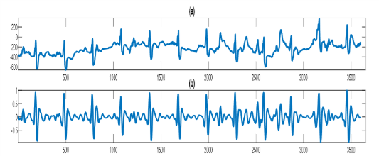
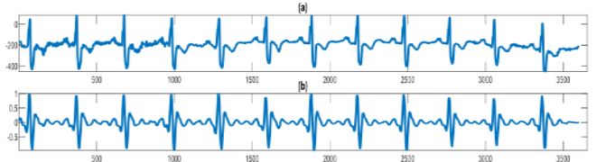
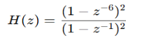
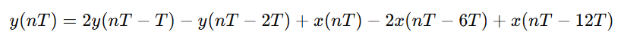
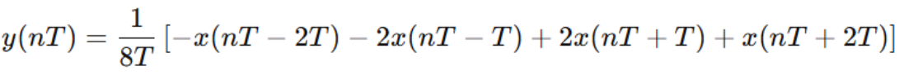
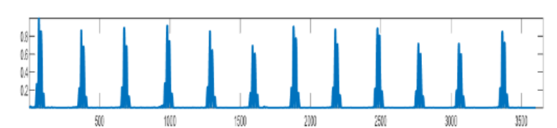
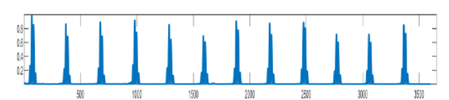
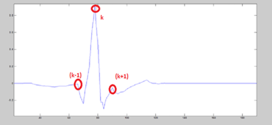
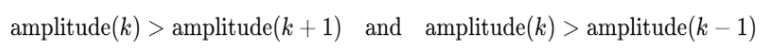

<h4>Introduction</h4>
An electrocardiogram (ECG) is a recording of the electrical activity of the heart during each cardiac cycle. It reflects the generation and propagation of electrical impulses that control heart contraction. ECG analysis helps assess heart rhythm, heart rate, and overall cardiac health. 

A typical ECG waveform consists of a P-wave, QRS complex, and T-wave. The QRS complex is a short-duration, high-amplitude component that represents ventricular depolarization. Within the QRS complex, the R-peak is the most prominent feature and serves as the most reliable reference point for timing measurements. Therefore, accurate detection of R-peaks is essential for reliable estimation of heart rate. 

Automated heart-rate detection systems primarily focus on reliable QRS detection, since noise, baseline drift, and muscle artefacts can distort ECG signals and reduce detection accuracy. To address these challenges, appropriate signal-processing techniques are applied prior to peak detection.<b> A thresholding method </b> is a simple R-peak detection technique in which ECG signal amplitudes are compared against a predefined or adaptive threshold value. Peaks exceeding the threshold are identified as R-peaks and are used to calculate RR intervals and heart rates. 

The <b>Pan–Tompkin's algorithm </b>is a widely used method for QRS detection. It enhances the QRS complex through band-pass filtering, differentiation, squaring, and moving window integration. These processing steps emphasize the steep slopes and energy of the QRS complex while suppressing noise and low-frequency components. An adaptive thresholding mechanism is then employed to distinguish true R-peaks from noise. 

In this experiment, heart rate is determined from ECG signals by detecting R-peaks using either the thresholding method or the Pan–Tompkin's algorithm, depending on the quality of the ECG signal. The detected R-peaks are used to calculate RR intervals, from which the heart rate is computed in beats per minute (BPM).  

  

 

  <b>Figure 1: ECG signal.</b>

 

<h4>1. Pan–Tompkins Algorithm for R-Peak Detection</h4>
The Pan–Tompkin's algorithm is a commonly used method for detecting QRS complexes and R-peaks in electrocardiogram (ECG) signals. It is designed to operate in real time and is widely applied in heart monitoring systems. The algorithm exploits the fact that the QRS complex has a higher amplitude, steeper slope, and shorter duration compared to other ECG components such as P and T waves. 

To identify R-peaks accurately, the Pan–Tompkin's algorithm processes the ECG signal in two main stages. In the pre-processing stage, the signal is enhanced to reduce noise and emphasize the QRS complex. In the decision-making stage, adaptive thresholds are used to distinguish true R-peaks from noise and other signal components. This structured approach enables reliable detection of heartbeats even under varying ECG signal quality. 
 

  

  <b>Figure 2: Functional block diagram of the Pan-Tompkins algorithm .</b>

<h4>A.  ECG Raw Data</h4>
The input to the algorithm is the raw ECG signal, which contains cardiac electrical activity along with noise and interference, as shown in figure 1.    
  

  

 

  <b>Figure-3 NST Database (a) Raw Signal Data and (b) Filtered Data .</b>

 

<h4>B. Pre-processing Stage</h4>

<h4>1.Band-Pass Filtering</h4>
The first step of the Pan–Tompkin's algorithm is band-pass filtering, which reduces the influence of noise components such as muscle noise, power-line interference, baseline wander, and T-wave interference. The desirable frequency band to maximize QRS energy lies approximately between 5–15 Hz. 

Since direct band-pass filter design is difficult, the algorithm achieves this by cascading a low-pass filter and a high-pass filter, resulting in an effective passband close to the required range. 
<b>Figure 2</b> depicts an ECG signal influenced by a powerline interfacial.
  

  

 

  <b>Figure-4 MIT Database (a) Raw Signal Data and (b) Filtered Data </b>

 

<h4>2.  Low-Pass Filter</h4>
The low-pass filter suppresses high-frequency noise while preserving the QRS complex. Its transfer function is given by: 
 

  

 
The corresponding difference equation is: </b>

  

 
This filter has a cutoff frequency of approximately 11 Hz, a gain of 36, and a processing delay of 6 samples. </b>

<h4>3. High Pass Filter</h4>
The high-pass filter removes low-frequency components such as baseline wander. It is designed to subtract the output of a low-pass filter from the original signal.  
<h>The transfer function is: 

  

 
  This filter has a low cutoff frequency of approximately 5 Hz, a gain of 32, and a delay of 16 samples
 

<h4>C. Derivative Operation</h4>
After band-pass filtering, the ECG signal is passed through a derivative filter to obtain information related to the slope of the QRS complex. Since the QRS complex has the steepest slope compared to other ECG components, differentiation enhances the QRS complex while suppressing slower varying components such as the P and T waves.  
A five-point derivative filter is used, whose transfer function is given by:

  

The corresponding difference equation is:

  

This operation highlights the rapid changes in the ECG signal associated with ventricular depolarization.

  

 

  Figure-5 NST Database (Derivative Output)

 

  

 

  Figure-6 MIT Database (Derivative Output)

 

<h4>D. Squaring Operation</h4>
The output of the derivative stage is then squared point-by-point according to:

  

 

This squaring operation serves the following purposes:

<ul>
  <li>Converts all signal values to positive</li>
  <li>Emphasizes higher-frequency components</li>
  <li>Enhances large-amplitude peaks corresponding to the QRS complex relative to other ECG components</li>
</ul>

This nonlinear amplification improves the detectability of the QRS complex and prepares the signal for further processing in the moving window integration stage.

  

 

  <b>Figure-7 NST Database (Squaring Output) .</b>

 

  

 

  <b>Figure-8 MIT Database (Squaring Output).</b>

 

<h4>E. Moving Window Integration</h4>

 A moving window integrator is applied to the squared signal to extract information about the width and energy of the QRS complex.

  

 

Where N represents the number of samples within the integration window.
The window width is typically chosen to be approximately 150 ms, which corresponds to the average duration of a QRS complex. This step produces a waveform in which each QRS complex appears as a single prominent peak.

  

 

  <b>Figure-9 NST Database (MWI Output) </b>

 

  

 

  <b>Figure-10 MIT Database (MWI Output)  </b>

 

<h4>F. Decision-Making Phase</h4>

The decision-making stage determines whether a detected peak corresponds to a true R-peak or noise.

<h4>G. Adaptive Thresholding</h4>

Two adaptive thresholds are used:

<ul>
  <li>A higher threshold for initial detection</li>
  <li>A lower threshold for search-back detection when a beat is missed</li>
</ul>

The thresholds are continuously updated using running estimates of:

<ul>
  <li>Signal peaks (SPK)</li>
  <li>Noise peaks (NPK)</li>
</ul>

This adaptive mechanism allows the algorithm to adjust to changes in signal amplitude and noise conditions.

  

 

  <b>Figure- 11 NST Database (QRS complex detected)  </b>

 

  

 

  <b>Figure-12 MIT Database (QRS complex detected)   </b>

 

<h4>H. Search-Back Mechanism</h4>

If no QRS complex is detected within a predefined time interval, a search-back procedure is initiated using the lower threshold. This helps recover missed R-peaks, particularly in cases of low-amplitude QRS complexes or sudden changes in signal morphology.

<h4>I. RR-Interval Constraints</h4>

To avoid false detections:

<ul>
  <li>A refractory period is enforced so that two R-peaks cannot occur within an unrealistically short interval</li>
  <li>RR intervals are monitored to distinguish true QRS complexes from T waves or noise</li>
</ul>

These constraints improve detection accuracy and temporal consistency of the identified R-peaks.

<h4>2. Threshold-Based Method for Heart Rate Determination</h4>

The thresholding method is a simple and time-efficient approach used for determining heart rate from ECG signals by detecting R-peaks. In this method, a predefined amplitude threshold is applied to the ECG signal such that only prominent peaks corresponding to R-peaks are detected, while peaks with amplitudes below the threshold are ignored. Since the R-peak has the highest amplitude among ECG components, it can be detected more easily compared to P and T waves.

Once the R-peaks are identified, the RR interval is calculated from the distance between successive R-peaks, and the heart rate is subsequently determined. Due to its reduced computational complexity and faster execution time, the thresholding method is suitable for approximate heart-rate estimation and research-oriented applications.

  <h4>A. R-Peak Detection Using Threshold Method</h4>

  

  Thresholding is a simple and computationally efficient technique for detecting R-peaks in ECG signals. In this method, a threshold value is selected such that only prominent peaks corresponding to R-peaks are detected, while smaller peaks caused by noise or other ECG components are ignored. The selected threshold value depends on the amplitude of characteristics of the incoming ECG signal.
  

  

    
  

   
  

    <b>Figure-13: Ecg signal with threshold value (T)    </b>
  

   

  

A sample is identified as an R-peak if it satisfies both of the following conditions:

  <ul>
  <li>The sample amplitude is greater than its neighboring samples</li>

  

    
  

   <li>The peak amplitude is greater than the predefined threshold:</li>
</ul>

  

    
  

  </ul>

  

  If both conditions are satisfied, the peak is labeled as a prominent R-peak.
  

  

  The threshold value is selected such that only R-peaks are detected, and other ECG components with lower amplitudes are excluded. Particularly for R-peak detection, the threshold value lies in the range of 0.4 mV to 1 mV.
  

  <h4>B. RR Interval Measurement</h4>

  

  The RR interval is defined as the time interval between two consecutive R-peaks in the ECG signal. Once the R-peaks are detected using the thresholding method, RR intervals are calculated by measuring the temporal distance between successive R-peak locations.
  

  

  The mean RR interval is calculated as the average of all RR intervals obtained from the ECG signal:
  

  

    
  

  <h4>C. Heart Rate Calculation</h4>

  

  Heart rate is defined as the number of heartbeats occurring per minute. Using the mean RR interval obtained from the ECG signal, the heart rate is calculated. The detected R-peaks and computed RR intervals serve as the basis for determining the heart rate in beats per minute (BPM).
  

  

    
  

